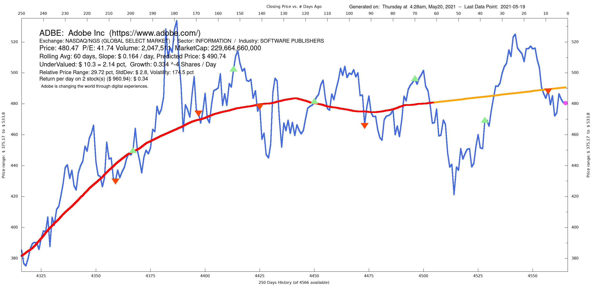
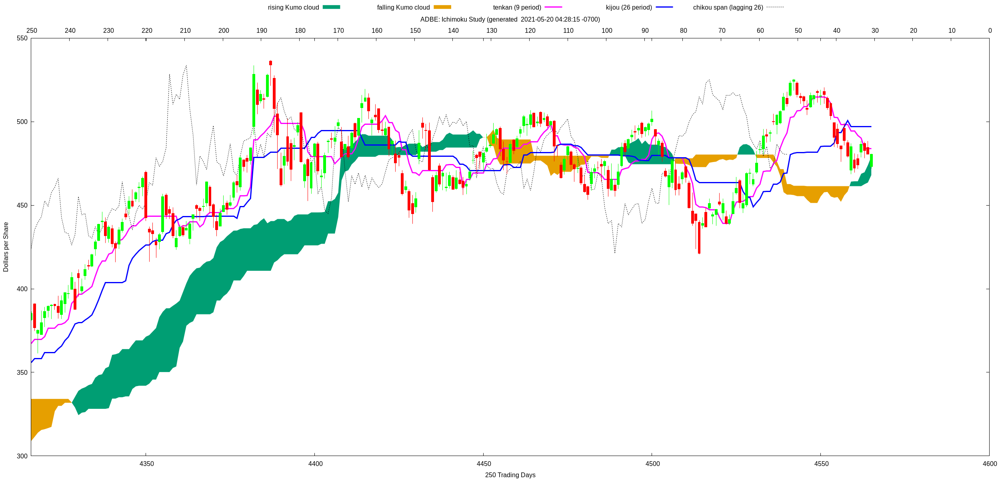
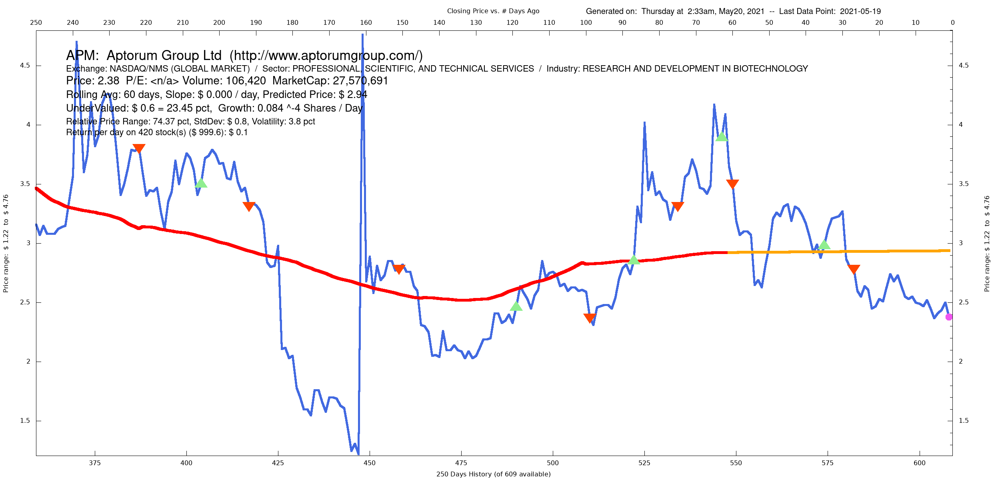
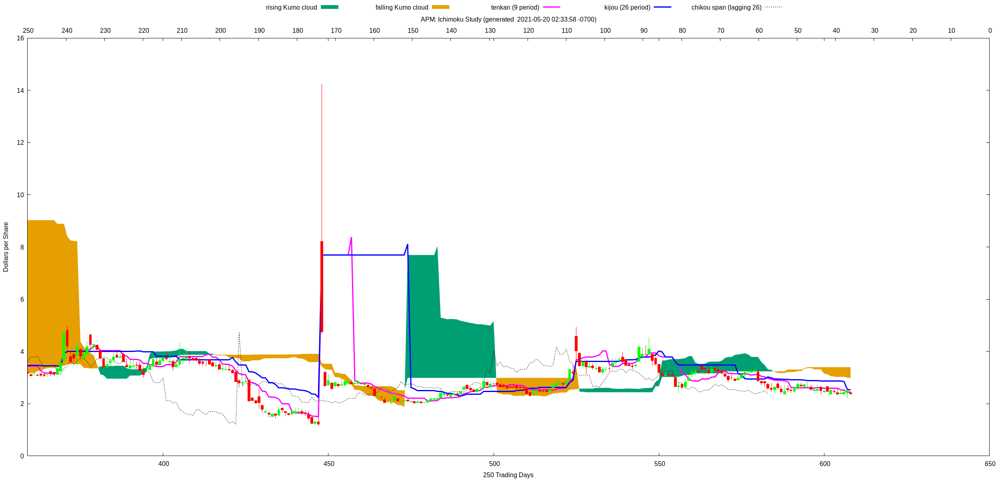
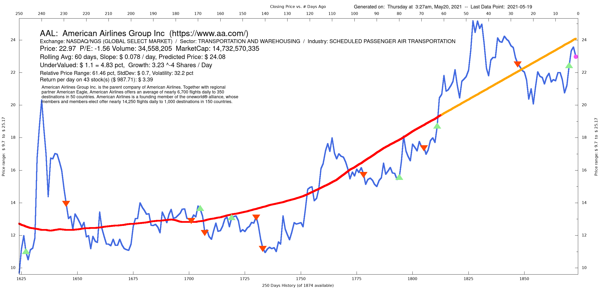
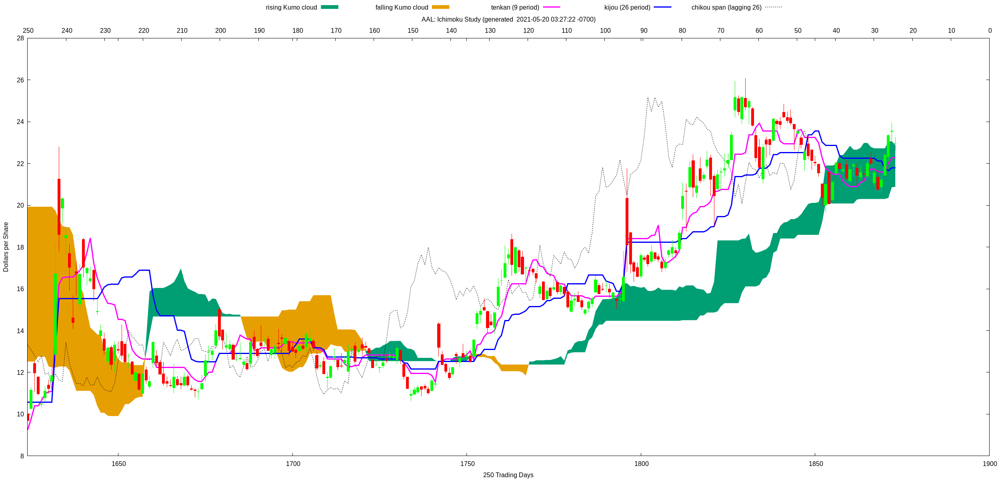

# Practical signal generation from the Ichimoku market analysis technique.  An excerpt.
## The following code is 100% original work, and a small portion of the signal analysis implementation in my Ruby on Rails application.  Brevity is intentional, but please feel free to direct any questions to me at matt.a.feenstra@gmail.com where I'll be happy to discuss further.  Thanks for looking!
---

